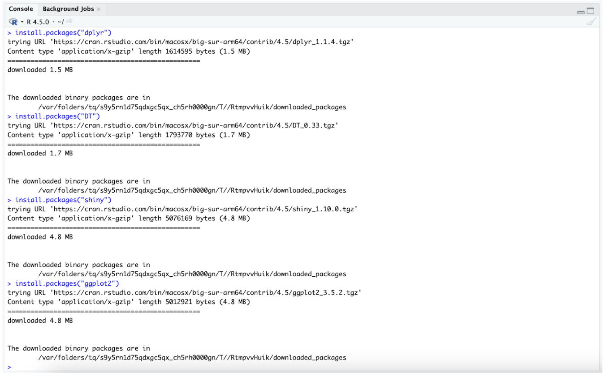

# Installing Required R Packages

1. Open RStudio.
2. In the *Console* pane at the bottom, paste the following commands, then press Enter:
```
install.packages("dplyr")
install.packages("DT")
install.packages("shiny")
install.packages("ggplot2")
```

These commands download and install the packages needed to run the MyFavoriteAlbums application.



