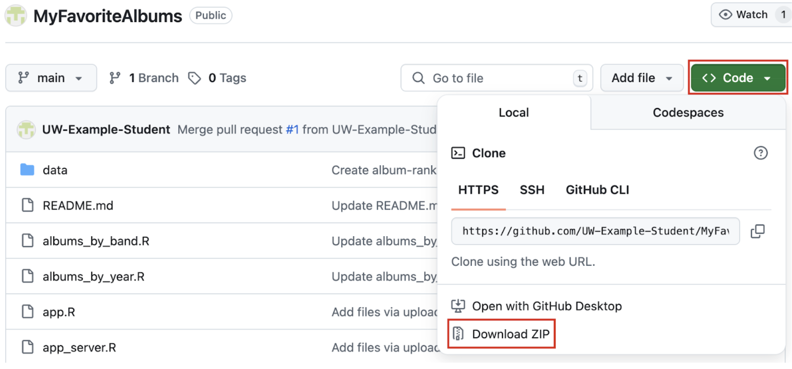

# Downloading MyFavoriteAlbums

1. Go to the [GitHub repository](https://github.com/UW-Example-Student/MyFavoriteAlbums).
2. Above the list of files, click the green **<> Code** button.
3. Once the dropdown menu appears, select **Download ZIP**.



4. Locate the downloaded ```.zip``` file (the ```Downloads``` folder is usually the default location) and unzip it. After unzipping, you will see a folder named  ```MyFavoriteAlbums-main```. This folder is where all the application files are located and ready to use.

